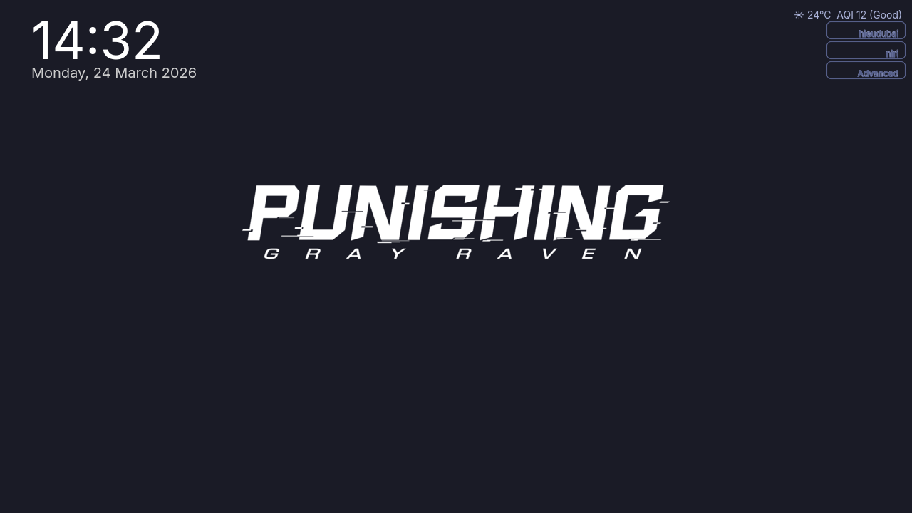
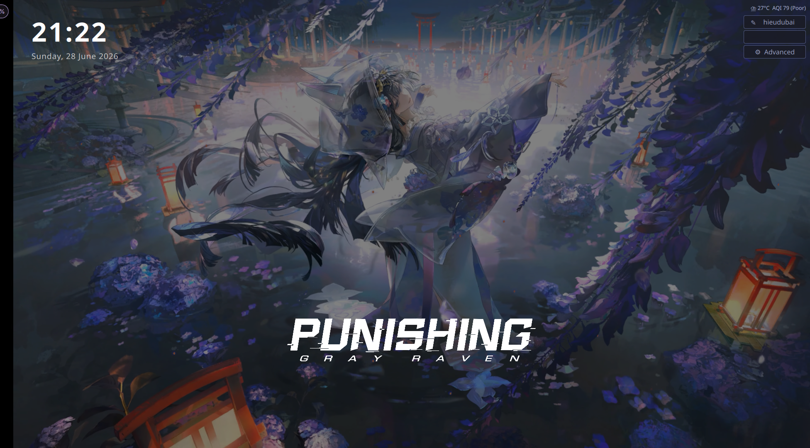

# Selena SDDM Theme

An animated SDDM login theme featuring **Selena** from *Punishing: Gray Raven* / *Wuthering Waves* (Kuro Games).  
Inspired by the Tokyo Night color palette — dark, sleek, and modern.

> 🌟 **Theme SDDM** có hình nền động, lấy cảm hứng từ Selena (Kuro Games) và bảng màu Tokyo Night.

---

## ⚠️ Important: You Must Provide a Background Video
## ⚠️ Quan trọng: Bạn Phải Tự Cung Cấp Video Nền

This theme plays a **looping MP4 background video**. The video file is **not included in this repo** — it's too large and everyone has different taste.

> Theme này chạy **video MP4 nền**. File video **không có trong repo** vì dung lượng lớn và mỗi người thích một kiểu khác nhau.

See [Adding a Background Video](#adding-a-background-video) below.  
Xem [Thêm Video Nền](#thêm-video-nền) bên dưới.

---

## Preview / Xem Trước

| Login Screen / Màn hình đăng nhập | Password Input / Nhập mật khẩu |
|:---:|:---:|
|  |  |

> Screenshots show the layout. Your actual screen will differ with your own video + live weather.  
> Ảnh chụp minh hoạ bố cục. Màn hình thực tế sẽ khác khi bạn thêm video + thời tiết tự động.

---

## Features / Tính năng

| English | Tiếng Việt |
|---------|-----------|
| Animated MP4 background | Video nền MP4 động |
| Clock & date (top-left) | Đồng hồ & ngày tháng (góc trên trái) |
| Weather + AQI (auto-detect location) | Thời tiết + chỉ số AQI (tự động định vị) |
| User switching (click to cycle) | Chuyển đổi người dùng (bấm để vòng qua) |
| Session switching (niri, KDE, Hyprland, etc.) | Chuyển session (niri, KDE, Hyprland, v.v.) |
| Power actions: Suspend, Reboot, Shutdown | Tác vụ nguồn: Tạm ngưng, Khởi động lại, Tắt máy |
| Show password toggle + Caps Lock indicator | Nút hiện mật khẩu + chỉ báo Caps Lock |
| Shake animation on failed login | Hiệu ứng rung khi sai mật khẩu |
| Fully scalable (any resolution) | Tự động co giãn theo mọi độ phân giải |
| Tokyo Night color palette | Bảng màu Tokyo Night |

---

## Requirements / Yêu cầu

| English | Tiếng Việt |
|---------|-----------|
| SDDM ≥ 0.20 | SDDM từ phiên bản 0.20 trở lên |
| Qt6 (or Qt5 — adjust `Metadata.desktop`) | Qt6 (hoặc Qt5 — sửa `Metadata.desktop`) |
| Qt Multimedia (`qt6-multimedia` or `qt5-multimedia`) | Qt Multimedia (gói `qt6-multimedia` hoặc `qt5-multimedia`) |
| An MP4 background video (you provide) | File video MP4 nền (tự cung cấp) |

---

## Installation / Cài đặt

### Arch Linux / EndeavourOS / CachyOS / Manjaro

```bash
# Dependencies / Phụ thuộc
sudo pacman -S sddm qt6-multimedia qt6-wayland

# Clone & install / Tải về & cài
git clone https://github.com/TheLiems-dev/selena-sddm-theme.git /tmp/selena
sudo cp -r /tmp/selena /usr/share/sddm/themes/selena
rm -rf /tmp/selena

# Set as theme / Đặt làm theme mặc định
echo "[Theme]
Current=selena" | sudo tee /etc/sddm.conf.d/theme.conf
```

### Fedora / RHEL

```bash
sudo dnf install sddm qt6-qtmultimedia qt6-qtwayland
git clone https://github.com/TheLiems-dev/selena-sddm-theme.git /tmp/selena
sudo cp -r /tmp/selena /usr/share/sddm/themes/selena
rm -rf /tmp/selena
echo "[Theme]
Current=selena" | sudo tee /etc/sddm.conf.d/theme.conf
```

### Debian / Ubuntu / Linux Mint

```bash
sudo apt install sddm qt6-multimedia qt6-wayland
git clone https://github.com/TheLiems-dev/selena-sddm-theme.git /tmp/selena
sudo cp -r /tmp/selena /usr/share/sddm/themes/selena
rm -rf /tmp/selena
echo "[Theme]
Current=selena" | sudo tee /etc/sddm.conf.d/theme.conf
```

### openSUSE

```bash
sudo zypper install sddm qt6-multimedia qt6-wayland
git clone https://github.com/TheLiems-dev/selena-sddm-theme.git /tmp/selena
sudo cp -r /tmp/selena /usr/share/sddm/themes/selena
rm -rf /tmp/selena
echo "[Theme]
Current=selena" | sudo tee /etc/sddm.conf.d/theme.conf
```

### Standalone / Independent Distros / Các bản phân phối độc lập

<details>
<summary><b>Void Linux</b></summary>

```bash
sudo xbps-install -S sddm qt6-multimedia qt6-wayland
git clone https://github.com/TheLiems-dev/selena-sddm-theme.git /tmp/selena
sudo cp -r /tmp/selena /usr/share/sddm/themes/selena
rm -rf /tmp/selena
echo "[Theme]
Current=selena" | sudo tee /etc/sddm.conf.d/theme.conf
```
</details>

<details>
<summary><b>Artix Linux (OpenRC / runit / s6)</b></summary>

```bash
# Enable SDDM for your init:
#   OpenRC:  sudo rc-update add sddm
#   runit:   sudo ln -s /etc/runit/sv/sddm /run/runit/service/
#   s6:      sudo s6-service-add default sddm

sudo pacman -S sddm qt6-multimedia qt6-wayland
git clone https://github.com/TheLiems-dev/selena-sddm-theme.git /tmp/selena
sudo cp -r /tmp/selena /usr/share/sddm/themes/selena
rm -rf /tmp/selena
echo "[Theme]
Current=selena" | sudo tee /etc/sddm.conf.d/theme.conf
```
</details>

<details>
<summary><b>Gentoo Linux</b></summary>

```bash
sudo emerge --ask x11-misc/sddm dev-qt/qtmultimedia:6
git clone https://github.com/TheLiems-dev/selena-sddm-theme.git /tmp/selena
sudo cp -r /tmp/selena /usr/share/sddm/themes/selena
rm -rf /tmp/selena
echo "[Theme]
Current=selena" | sudo tee /etc/sddm.conf.d/theme.conf
```
</details>

<details>
<summary><b>NixOS</b></summary>

In `/etc/nixos/configuration.nix` or your flake:

```nix
{ config, pkgs, ... }:
let
  selenaTheme = pkgs.stdenv.mkDerivation {
    name = "selena-sddm-theme";
    src = pkgs.fetchFromGitHub {
      owner = "TheLiems-dev";
      repo = "selena-sddm-theme";
      rev = "main";
      sha256 = "0000000000000000000000000000000000000000000000000000"; # replace after first build
    };
    installPhase = ''
      mkdir -p $out/share/sddm/themes/selena
      cp -r ./* $out/share/sddm/themes/selena/
    '';
  };
in {
  services.displayManager.sddm = {
    enable = true;
    theme = "${selenaTheme}/share/sddm/themes/selena";
    extraConfig = ''
      [Theme]
      Current=selena
    '';
  };
}
```

Rebuild: `sudo nixos-rebuild switch`
</details>

<details>
<summary><b>Alpine Linux</b></summary>

```bash
sudo apk add sddm qt6-qtmultimedia qt6-wayland
git clone https://github.com/TheLiems-dev/selena-sddm-theme.git /tmp/selena
sudo cp -r /tmp/selena /usr/share/sddm/themes/selena
rm -rf /tmp/selena
echo "[Theme]
Current=selena" | sudo tee /etc/sddm.conf.d/theme.conf
```
</details>

---

## Adding a Background Video / Thêm Video Nền

**You must provide this file yourself — it is not included in the repo.**  
**Bạn phải tự cung cấp file này — nó không có trong repo.**

The theme plays `background.mp4` from its own directory.  
Theme sẽ chạy file `background.mp4` trong thư mục của nó.

```bash
# Copy your video / Copy video của bạn vào
sudo cp /path/to/your/video.mp4 /usr/share/sddm/themes/selena/background.mp4
```

### Video Tips / Mẹo về Video

| English | Tiếng Việt |
|---------|-----------|
| Resolution: 1920×1080 or higher | Độ phân giải: 1920×1080 hoặc cao hơn |
| Loop seamlessly (no abrupt cuts) | Vòng lặp mượt (không bị cut đột ngột) |
| Keep under 200 MB for faster loading | Giữ dưới 200 MB để load nhanh hơn |
| Audio: not needed — theme mutes it | Âm thanh: không cần — theme đã tắt âm |
| Format: MP4 with H.264 (widest support) | Định dạng: MP4 H.264 (tương thích nhất) |

### Example: Re-encode without audio / Ví dụ: Nén lại không âm thanh

```bash
ffmpeg -i your_source.mp4 -c:v libx264 -preset medium -an background.mp4
```

---

## Customization / Tuỳ chỉnh

### Colors / Màu sắc

Edit these values in `Main.qml`.  
Sửa các giá trị sau trong file `Main.qml`.

| Variable | Default | Description / Mô tả |
|----------|---------|---------------------|
| Background tint | `#1a1b26` | Tokyo Night nền tối |
| Text | `#a9b1d6` | Chữ màu xám nhạt |
| Accent (focused) | `#7aa2f7` | Xanh dương (khi focus) |
| Error | `#f7768e` | Đỏ (báo lỗi) |
| Warning (Caps Lock) | `#e0af68` | Vàng (Caps Lock) |
| Muted | `#565f89` | Xám (viền, chữ phụ) |

### Layout / Bố cục

| What / Cái gì | Where to adjust / Sửa ở đâu |
|---------------|---------------------------|
| Clock position | `topMargin`, `leftMargin` in `infoPanel` |
| Logo + password position | `bottomMargin` in `bottomGroup` |
| Action buttons | `topMargin`, `rightMargin` in the right column |

### Weather / AQI / Thời tiết

Three free APIs, no key needed — location → weather → AQI.  
Ba API miễn phí, không cần key — định vị → thời tiết → AQI.

- [ip-api.com](http://ip-api.com) — location / định vị
- [Open-Meteo](https://open-meteo.com) — weather / thời tiết
- [Open-Meteo AQI](https://open-meteo.com/en/docs/air-quality-api) — air quality / chất lượng không khí

---

## Troubleshooting / Khắc phục sự cố

### SDDM shows a blank screen / Màn hình đen

- Make sure `qt6-multimedia` is installed / Kiểm tra đã cài `qt6-multimedia`
- Check video path in `Main.qml` line 22 / Kiểm tra đường dẫn video trong `Main.qml` dòng 22
- Try disabling video: comment lines 19–33 in `Main.qml` / Thử tắt video: comment dòng 19–33 trong `Main.qml`
- Check logs: `journalctl -u sddm -e` / Xem log: `journalctl -u sddm -e`

### Weather not showing / Không hiện thời tiết

- Internet must be available at the login screen / Cần có mạng tại màn hình đăng nhập
- Check if APIs are reachable / Kiểm tra các API có truy cập được không
- Some distros block network in SDDM — add firewall exceptions / Một số distro chặn mạng trong SDDM — cần thêm exception

### User / Session switching not working / Không chuyển được user/session

- The theme uses invisible `ListView` helpers bound to SDDM's models (`userModel`, `sessionModel`)
- Theme dùng `ListView` ẩn kết nối với model của SDDM
- Upgrade SDDM to ≥ 0.20 / Nâng cấp SDDM lên ≥ 0.20
- Set `Relogin=true` in `/etc/sddm.conf` / Đặt `Relogin=true` trong `/etc/sddm.conf`

---

## File Structure / Cấu trúc thư mục

```
/usr/share/sddm/themes/selena/
├── background.mp4            # Your video (not included) / Video của bạn (không có sẵn)
├── Main.qml                  # Main login script / Script đăng nhập chính
├── preview.qml               # Preview script / Script xem trước
├── Metadata.desktop          # SDDM theme metadata / Metadata theme
├── theme.conf                # Reserved config / Cấu hình dự phòng
├── Kuro_Games_Logo.png       # Kuro Games watermark / Logo Kuro Games
├── logo pgr.png              # PGR logo / Logo PGR
├── preview-login.png         # Preview screenshot / Ảnh chụp màn hình
├── preview-password.png      # Preview screenshot / Ảnh chụp màn hình
└── components/               # Reusable QML components / Thành phần QML dùng chung
    ├── InfoPanel.qml         # Clock & date display / Đồng hồ & ngày tháng
    ├── PasswordPanel.qml     # Password input, show password, caps lock
    ├── ActionButtons.qml     # User switch, session switch, power menu
    └── WeatherService.qml    # Weather + AQI fetch logic (ip-api → Open-Meteo)
```

---

## Credits / Ghi công

| English | Tiếng Việt |
|---------|-----------|
| Tokyo Night color palette by enkia | Bảng màu Tokyo Night bởi enkia |
| Selena character © Kuro Games | Nhân vật Selena © Kuro Games |
| SDDM — Simple Desktop Display Manager | SDDM — Trình quản lý màn hình đăng nhập |
| Weather data by Open-Meteo, ip-api.com | Dữ liệu thời tiết từ Open-Meteo, ip-api.com |

## License / Giấy phép

MIT
